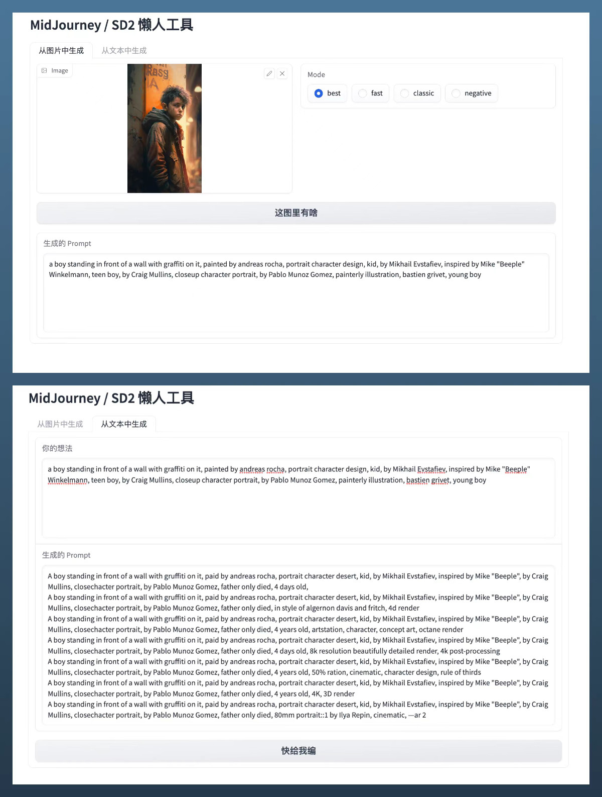
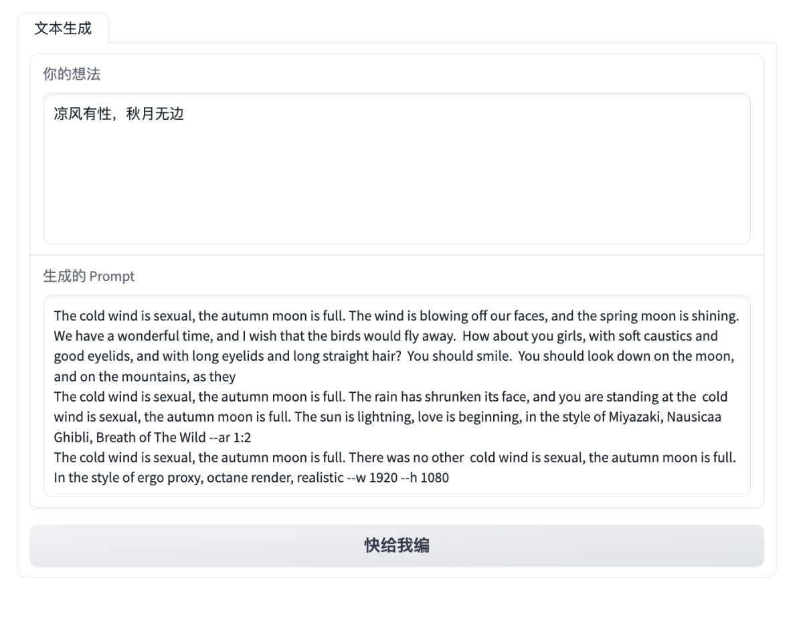

# Docker 作图咒语生成器

> 使用模型来生成作图咒语的偷懒工具，支持 MidJourney、Stable Diffusion 等。

## 功能预览

如同 MidJourney 官方新推出的功能，工具支持一键从图片中解析出 Prompt 描述，并能够基于描述进行扩展，以便二次图片生成。

工具支持直接使用中文进行原始 Prompt 描述，并能够将中文转换为模型生成效果更好的英文 Prompt 描述。

## 使用方法

## 相关项目

模型类项目:

- Prompt Model: [succinctly/text2image-prompt-generator](https://huggingface.co/succinctly/text2image-prompt-generator)
- Translator Model: [Helsinki-NLP/opus-mt-zh-en](https://huggingface.co/Helsinki-NLP/opus-mt-zh-en) / [GitHub](https://github.com/Helsinki-NLP/OPUS-MT-train)
- CLIP Model: [laion/CLIP-ViT-H-14-laion2B-s32B-b79K](https://huggingface.co/laion/CLIP-ViT-H-14-laion2B-s32B-b79K)

数据集项目:

- Datasets: [succinctlyai/midjourney-texttoimage](https://www.kaggle.com/datasets/succinctlyai/midjourney-texttoimage)
